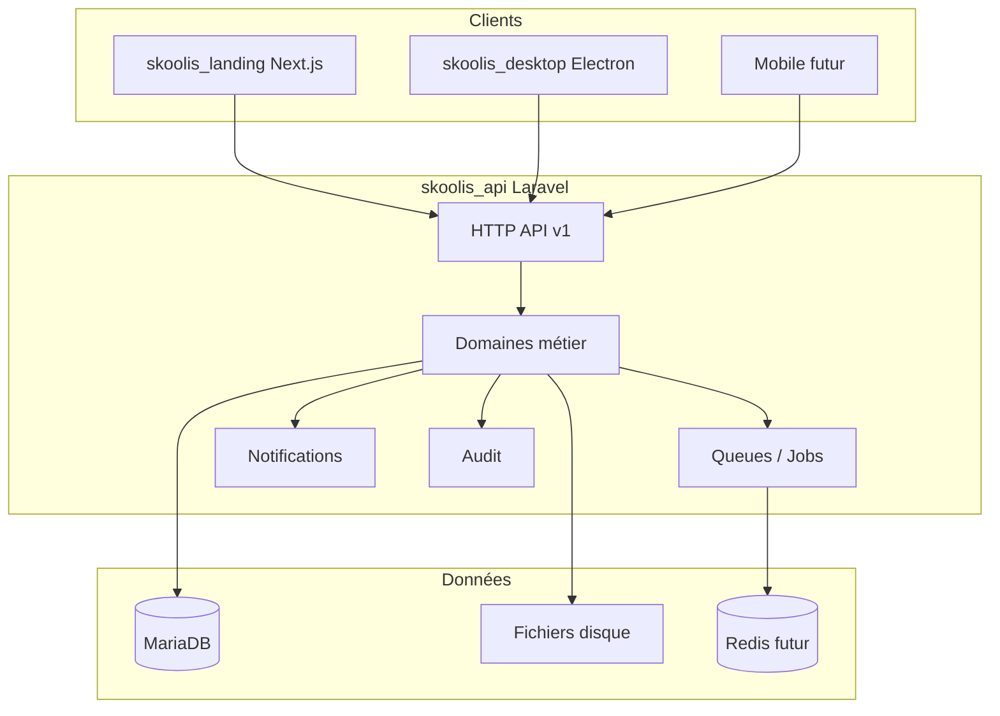

# Skoolis — architecture cible

## Principes

- **API unique** : Web, Electron, mobile et intégrations consomment `routes/api.php` (préfixe `api/v1`). Aucune logique métier dans les clients.
- **Multi-écoles centralisé** : une instance applicative, isolation des données par `school_id` (et rôles Spatie par équipe = école).
- **Longévité (20 ans)** : identifiants **UUID** sur les entités métier synchronisables ; **années scolaires** comme axe d’archivage et de filtrage ; **soft delete** ; **audit** systématique sur les actions sensibles.
- **Fichiers hors base** : PDF, photos, bulletins dans `storage/app/schools/{school_uuid}/...` (pas de BLOB en MySQL/MariaDB).

## Schéma logique

## Stack déploiement (référence)

Nginx, PHP-FPM, MariaDB, Redis (cache, sessions, queues), Supervisor (workers). Le détail est dans `infrastructure/`.

## Domaines applicatifs (ERP)

Chaque domaine sous `app/Domains/{Name}/` regroupe modèles, actions, DTO, politiques et événements **liés au même contexte métier**. Les dépendances croisées passent par des services ou des événements, pas par des accès directs aux modèles d’un autre domaine sans contrat clair.

Modules prévus : School, Student, Teacher, Parent, Attendance, Grades, Bulletin, Payments, Notifications, Auth, Audit, Sync, Settings.

## Synchronisation (futur)

Les clients ne génèrent pas les règles métier. La sync repose sur des **UUID** stables, des **horodatages**, et des **API de sync** (versionnées) décrites dans `docs/architecture/sync-strategy.md` lorsque le besoin sera formalisé.
